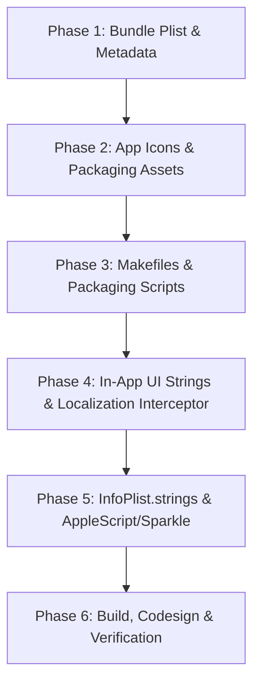

# VLC macOS ("MacLC") Branding & Renaming Audit Reconnaissance Report

**Audit Target:** VLC 4.0-dev (`vlc-master`) macOS App Bundle & Identity  
**Target Brand:** "MacLC" (replacing user-visible "VLC" / "VLC media player")  
**Scope:** macOS application bundle, metadata, UI, build rules, packaging, and runtime subsystems.  
**Out of Scope:** Windows (NSIS, MSI, WinRT), Linux/Qt, Android, iOS/tvOS, skins2.

---

## 1. User-Visible App Name in the macOS Bundle & Build System

The user-visible identity of the macOS application bundle is defined across plist templates, build/packaging shell scripts, Automake configuration files, and the Xcode project.

### 1.1 `share/Info.plist.in` (Source Template for Bundle `Info.plist`)
`share/Info.plist.in` is the canonical template from which `build/share/macosx/Info.plist` is generated by Autoconf.

- **`CFBundleExecutable`** ([`share/Info.plist.in:11-12`](file:///Users/omarbenmustapha/Downloads/vlc-master/share/Info.plist.in#L11-L12)):
  ```xml
  <key>CFBundleExecutable</key>
  <string>VLC</string>
  ```
  Specifies the main Mach-O binary executed when the bundle launches. Renaming this to `MacLC` requires coordinating with `package.mak:80` and `build.sh:298`.
- **`CFBundleIconFile`** ([`share/Info.plist.in:13-14`](file:///Users/omarbenmustapha/Downloads/vlc-master/share/Info.plist.in#L13-L14)):
  ```xml
  <key>CFBundleIconFile</key>
  <string>VLC.icns</string>
  ```
  Specifies the main application icon file located in `Contents/Resources/`.
- **`CFBundleName`** ([`share/Info.plist.in:19-20`](file:///Users/omarbenmustapha/Downloads/vlc-master/share/Info.plist.in#L19-L20)):
  ```xml
  <key>CFBundleName</key>
  <string>VLC</string>
  ```
  Short bundle name (16 characters or less). Displayed by macOS in the menu bar beside the Apple menu.
- **`CFBundleDisplayName`** ([`share/Info.plist.in:21-22`](file:///Users/omarbenmustapha/Downloads/vlc-master/share/Info.plist.in#L21-L22)):
  ```xml
  <key>CFBundleDisplayName</key>
  <string>VLC</string>
  ```
  User-visible display name shown by the Finder and Dock under the icon.
- **`CFBundleSignature`** ([`share/Info.plist.in:27-28`](file:///Users/omarbenmustapha/Downloads/vlc-master/share/Info.plist.in#L27-L28)):
  ```xml
  <key>CFBundleSignature</key>
  <string>VLC#</string>
  ```
  Classic 4-character Mac OSType creator code (`VLC#`).
- **`BreakpadProduct` & `BreakpadVendor`** ([`share/Info.plist.in:29-32`](file:///Users/omarbenmustapha/Downloads/vlc-master/share/Info.plist.in#L29-L32)):
  ```xml
  <key>BreakpadProduct</key>
  <string>VLC</string>
  <key>BreakpadVendor</key>
  <string>VideoLAN</string>
  ```
  Product name tag submitted with Google Breakpad crash reports.
- **`NSHumanReadableCopyright`** ([`share/Info.plist.in:66-67`](file:///Users/omarbenmustapha/Downloads/vlc-master/share/Info.plist.in#L66-L67)):
  ```xml
  <key>NSHumanReadableCopyright</key>
  <string>Copyright (c) @COPYRIGHT_YEARS@ VLC authors and VideoLAN</string>
  ```
  Displayed in the About window and Finder Get Info.
- **Privacy & Permission Prompts (TCC Usage Descriptions)** ([`share/Info.plist.in:68-83`](file:///Users/omarbenmustapha/Downloads/vlc-master/share/Info.plist.in#L68-L83)):
  - Line 69: `<string>VLC wants to access the camera as requested by the user.</string>`
  - Line 71: `<string>VLC wants to access the microphone as requested by the user.</string>`
  - Line 73: `<string>VLC wants to pause and resume external media players.</string>`
  - Line 75: `<string>VLC wants to access the desktop folder as requested by the user.</string>`
  - Line 77: `<string>VLC wants to access the documents folder as requested by the user.</string>`
  - Line 79: `<string>VLC wants to access the downloads folder as requested by the user.</string>`
  - Line 81: `<string>VLC wants to access a network volume as requested by the user.</string>`
  - Line 83: `<string>VLC wants to access a removable volume as requested by the user.</string>`
- **Document Types & UTI Descriptions** ([`share/Info.plist.in:216`](file:///Users/omarbenmustapha/Downloads/vlc-master/share/Info.plist.in#L216) & [`share/Info.plist.in:1660`](file:///Users/omarbenmustapha/Downloads/vlc-master/share/Info.plist.in#L1660)):
  - Line 216: `<string>VLC file</string>` (`CFBundleTypeName`)
  - Line 1660: `<string>VLC playlist file</string>` (`UTTypeDescription` for UTI `org.videolan.vlc`)

### 1.2 `configure.ac` and Root `Makefile.am`
- **`configure.ac:5`** ([`configure.ac:5`](file:///Users/omarbenmustapha/Downloads/vlc-master/configure.ac#L5)):
  `AC_INIT([vlc], [4.0.0-dev])` sets autoconf macro `PACKAGE=vlc`.
  **CRITICAL:** `AC_INIT` controls `PACKAGE_NAME`, `pkgdatadir` (`/share/vlc`), `pkglibdir` (`/lib/vlc`), gettext domain, and include paths. **It must NOT be renamed to `maclc`**; doing so breaks the Autotools structure, core module loader, and contrib lookup.
- **`configure.ac:5318-5322`** ([`configure.ac:5318-5322`](file:///Users/omarbenmustapha/Downloads/vlc-master/configure.ac#L5318-L5322)):
  ```m4
  AM_COND_IF([HAVE_DARWIN], [
    AC_CONFIG_FILES([
      share/macosx/Info.plist:share/Info.plist.in
    ])
  ])
  ```
  Rules out that `configure.ac` writes `CFBundleName` directly; it merely generates `share/macosx/Info.plist` from `share/Info.plist.in`.
- **`configure.ac:5233-5255`** ([`configure.ac:5233-5255`](file:///Users/omarbenmustapha/Downloads/vlc-master/configure.ac#L5233-L5255)):
  Defines `COPYRIGHT_YEARS` and `COPYRIGHT_MESSAGE` (`Copyright © 1996-2026 the VideoLAN team`).
- **`Makefile.am:217`** ([`Makefile.am:217`](file:///Users/omarbenmustapha/Downloads/vlc-master/Makefile.am#L217)):
  `include extras/package/macosx/package.mak` directly incorporates macOS bundle creation targets into top-level Automake.

### 1.3 `extras/package/macosx/package.mak`
`package.mak` defines all bundle assembly and disk image rules:
- **`VLC.app` Target Name** ([`package.mak:25`](file:///Users/omarbenmustapha/Downloads/vlc-master/extras/package/macosx/package.mak#L25)):
  `VLC.app: macos-install` defines the directory name of the output bundle.
- **PkgInfo File** ([`package.mak:71`](file:///Users/omarbenmustapha/Downloads/vlc-master/extras/package/macosx/package.mak#L71)):
  `printf "APPLVLC#" >| $@/Contents/PkgInfo` writes OSType type `APPL` and creator `VLC#`.
- **Binary Installation inside Bundle** ([`package.mak:80-81`](file:///Users/omarbenmustapha/Downloads/vlc-master/extras/package/macosx/package.mak#L80-L81)):
  ```makefile
  cp "$(macos_destdir)$(prefix)/bin/vlc" $@/Contents/MacOS/VLC
  install_name_tool -rpath "$(libdir)" "@executable_path/../Frameworks/" $@/Contents/MacOS/VLC
  ```
  Copies the UNIX binary `bin/vlc` into the bundle as `Contents/MacOS/VLC`.
- **DMG Packaging Volume Name** ([`package.mak:102-103`](file:///Users/omarbenmustapha/Downloads/vlc-master/extras/package/macosx/package.mak#L102-L103) & [`package.mak:113-114`](file:///Users/omarbenmustapha/Downloads/vlc-master/extras/package/macosx/package.mak#L113-L114)):
  - `dmgbuild` volume title: `"VLC Media Player"`
  - `hdiutil` fallback volume title: `-volname "VLC Media Player"`
  - Output DMG name: `vlc-$(VERSION).dmg`
- **Release Archives** ([`package.mak:120-137`](file:///Users/omarbenmustapha/Downloads/vlc-master/extras/package/macosx/package.mak#L120-L137)):
  Creates `vlc-$(VERSION).zip` and `vlc-$(VERSION)-release.zip`.
  Line 135: `install_name_tool -add_rpath "@executable_path/VLC.app/Contents/Frameworks" $(top_builddir)/vlc-$(VERSION)-release/vlc-cache-gen`

### 1.4 `extras/package/macosx/build.sh`
- **Bundle Target Execution** ([`build.sh:284-285`](file:///Users/omarbenmustapha/Downloads/vlc-master/extras/package/macosx/build.sh#L284-L285)):
  `info "Preparing VLC.app"` / `make VLC.app`.
- **Stripping & Symbol Generation** ([`build.sh:288-298`](file:///Users/omarbenmustapha/Downloads/vlc-master/extras/package/macosx/build.sh#L288-L298)):
  - Line 290: `cp -Rp VLC.app VLC-debug.app`
  - Line 298: `find VLC.app/ -type f -name "VLC" -exec strip -x {} \;`
  - Lines 307, 315, 318: Calls `make package-macosx-release`, `make package-macosx-zip`, and `make package-macosx`.

### 1.5 `extras/package/macosx/configure.sh`
- Options passed: `--enable-macosx`, `--enable-osx-notifications`, `--enable-macosx-avfoundation` ([`configure.sh:8-17`](file:///Users/omarbenmustapha/Downloads/vlc-master/extras/package/macosx/configure.sh#L8-L17)).

### 1.6 `extras/package/macosx/codesign.sh`
- Code signing target: Hardcoded references to `VLC.app` at lines 34, 107, 108, 109, 113, 114, 115, 117, 118, 119, 120, 121, 126, 132, 133, 135, 140, 145, 151, 158, 161, 164, 167, 170 ([`codesign.sh:34-170`](file:///Users/omarbenmustapha/Downloads/vlc-master/extras/package/macosx/codesign.sh#L34-L170)).
  Line 151: `sign "VLC.app"`
  Line 167: `codesign --verify --deep --strict --verbose=4 VLC.app`
  Line 170: `spctl -a -t exec -vv VLC.app`

### 1.7 `extras/package/macosx/VLC.xcodeproj/project.pbxproj`
- Target settings:
  - `PRODUCT_NAME = VLC;` at lines 2951, 3004, 3057 ([`project.pbxproj:2951`](file:///Users/omarbenmustapha/Downloads/vlc-master/extras/package/macosx/VLC.xcodeproj/project.pbxproj#L2951)).
  - `PRODUCT_NAME = "$(TARGET_NAME)";` at lines 2700, 2741, 2782, 2822, 2861, 2900.
  - `PRODUCT_BUNDLE_IDENTIFIER = org.videolan.vlc;` at lines 2699, 2740, 2781, 2821, 2860, 2899.
  - `INFOPLIST_FILE = "$(SRCROOT)/../../../build/share/macosx/Info.plist";` at lines 2690, 2732, 2773, 2813, 2853, 2892.

### 1.8 DMG Assets and Entitlements
- **`extras/package/macosx/dmg/dmg_settings.py`**:
  - Line 23 ([`dmg_settings.py:23`](file:///Users/omarbenmustapha/Downloads/vlc-master/extras/package/macosx/dmg/dmg_settings.py#L23)): `application = defines.get('app', 'VLC.app')`
  - Line 40 ([`dmg_settings.py:40`](file:///Users/omarbenmustapha/Downloads/vlc-master/extras/package/macosx/dmg/dmg_settings.py#L40)): `appname: (181, 168)` (icon coordinates on the background)
  - Line 45 ([`dmg_settings.py:45`](file:///Users/omarbenmustapha/Downloads/vlc-master/extras/package/macosx/dmg/dmg_settings.py#L45)): `background = 'background.tiff'`
  - Line 60 ([`dmg_settings.py:60`](file:///Users/omarbenmustapha/Downloads/vlc-master/extras/package/macosx/dmg/dmg_settings.py#L60)): `icon = 'disk_image.icns'`
- **`extras/package/macosx/dmg/background.tiff`**: 573x297 px TIFF graphic showing the drag-and-drop prompt onto the Applications folder.
- **`extras/package/macosx/dmg/disk_image.icns`**: Volume icon displayed when the DMG mounts.
- **`extras/package/macosx/asset_sources/vlc_app_icon.svg`**: Source vector icon for VLC.
- **`extras/package/macosx/VLC.entitlements`** ([`VLC.entitlements:5`](file:///Users/omarbenmustapha/Downloads/vlc-master/extras/package/macosx/VLC.entitlements#L5)):
  App Sandbox configuration: `<key>com.apple.security.app-sandbox</key><true/>`.
- **`extras/package/macosx/vlc-hardening.entitlements`** ([`vlc-hardening.entitlements:1-17`](file:///Users/omarbenmustapha/Downloads/vlc-master/extras/package/macosx/vlc-hardening.entitlements#L1-L17)):
  Hardened runtime entitlements (`apple-events`, `cs.allow-jit`, `cs.disable-library-validation`, `audio-input`, `camera`).

---

## 2. Bundle Identifier(s) & Runtime Dependencies

### 2.1 Current Value
- Canonical Identifier: `org.videolan.vlc`
  Defined in [`share/Info.plist.in:16`](file:///Users/omarbenmustapha/Downloads/vlc-master/share/Info.plist.in#L16) (`<key>CFBundleIdentifier</key><string>org.videolan.vlc</string>`) and [`VLC.xcodeproj/project.pbxproj:2699`](file:///Users/omarbenmustapha/Downloads/vlc-master/extras/package/macosx/VLC.xcodeproj/project.pbxproj#L2699).

### 2.2 Every File Where `org.videolan.vlc` Appears (macOS Relevant Context)
1. **`share/Info.plist.in`**:
   - Line 16 ([`share/Info.plist.in:16`](file:///Users/omarbenmustapha/Downloads/vlc-master/share/Info.plist.in#L16)): `CFBundleIdentifier` -> `org.videolan.vlc`
   - Line 211 ([`share/Info.plist.in:211`](file:///Users/omarbenmustapha/Downloads/vlc-master/share/Info.plist.in#L211)): `CFBundleDocumentTypes` -> `LSItemContentTypes` -> `org.videolan.vlc`
   - Line 1667 ([`share/Info.plist.in:1667`](file:///Users/omarbenmustapha/Downloads/vlc-master/share/Info.plist.in#L1667)): `UTExportedTypeDeclarations` -> `UTTypeIdentifier` -> `org.videolan.vlc`
2. **`src/darwin/dirs.m`**:
   - Line 211 ([`src/darwin/dirs.m:211`](file:///Users/omarbenmustapha/Downloads/vlc-master/src/darwin/dirs.m#L211)): Fallback bundle identifier: `NSString *identifier = @"org.videolan.vlc";`
3. **`modules/gui/macosx/main/VLCMain+OldPrefs.m`**:
   - Line 126 ([`modules/gui/macosx/main/VLCMain+OldPrefs.m:126`](file:///Users/omarbenmustapha/Downloads/vlc-master/modules/gui/macosx/main/VLCMain+OldPrefs.m#L126)):
     `[[NSURL alloc] initFileURLWithPath:[preferences stringByAppendingPathComponent:@"org.videolan.vlc"]]`
4. **`modules/gui/macosx/main/VLCMain+Sparkle.m`**:
   - Line 63 ([`modules/gui/macosx/main/VLCMain+Sparkle.m:63`](file:///Users/omarbenmustapha/Downloads/vlc-master/modules/gui/macosx/main/VLCMain+Sparkle.m#L63)):
     Sparkle NSError domain: `[NSError errorWithDomain:@"org.videolan.vlc.Sparkle" code:1 ...]`
5. **`modules/gui/macosx/imported/SPMediaKeyTap/SPMediaKeyTap.m`**:
   - Line 179 ([`modules/gui/macosx/imported/SPMediaKeyTap/SPMediaKeyTap.m:179`](file:///Users/omarbenmustapha/Downloads/vlc-master/modules/gui/macosx/imported/SPMediaKeyTap/SPMediaKeyTap.m#L179)): Fallback identifier: `ourIdentifier = @"org.videolan.vlc";`
   - Line 190 ([`modules/gui/macosx/imported/SPMediaKeyTap/SPMediaKeyTap.m:190`](file:///Users/omarbenmustapha/Downloads/vlc-master/modules/gui/macosx/imported/SPMediaKeyTap/SPMediaKeyTap.m#L190)): Known media player list: `@"org.videolan.vlc"`
6. **`modules/gui/macosx/library/VLCLibraryDataTypes.m`**:
   - Line 35 ([`modules/gui/macosx/library/VLCLibraryDataTypes.m:35`](file:///Users/omarbenmustapha/Downloads/vlc-master/modules/gui/macosx/library/VLCLibraryDataTypes.m#L35)): Internal media library drag UTI: `NSString * const VLCMediaLibraryMediaItemUTI = @"org.videolan.vlc.VLCMediaLibraryMediaItem";`
7. **`modules/gui/macosx/playqueue/VLCPlayQueueItem.m`**:
   - Line 32 ([`modules/gui/macosx/playqueue/VLCPlayQueueItem.m:32`](file:///Users/omarbenmustapha/Downloads/vlc-master/modules/gui/macosx/playqueue/VLCPlayQueueItem.m#L32)): Internal pasteboard type: `NSString *VLCPlaylistItemPasteboardType = @"org.videolan.vlc.playlistitemtype";`
8. **GCD Dispatch Queue Labels**:
   - `modules/gui/macosx/library/playlist-library/VLCLibraryPlaylistDataSource.m:67`: `"org.videolan.vlc.libraryplaylistdatasource.queue"`
   - `modules/gui/macosx/library/media-source/VLCMediaSourceDataSource.m:90`: `"org.videolan.vlc.media-source-child-count"`
   - `modules/gui/macosx/windows/video/VLCVoutView.m:113`: `"org.videolan.vlc.vout.events"`
   - `modules/video_output/window_macosx.m:172`: `"org.videolan.vlc.vout"`
9. **`extras/package/macosx/VLC.xcodeproj/project.pbxproj`**:
   - Lines 2699, 2740, 2781, 2821, 2860, 2899: `PRODUCT_BUNDLE_IDENTIFIER = org.videolan.vlc;`
10. **`modules/gui/macosx/tests/VLCMacOSXTests-Info.plist`**:
    - Line 10: `org.videolan.VLCMacOSXTests`

*(Note: Out-of-scope files containing `org.videolan.vlc` include Linux AppData `share/org.videolan.vlc.appdata.xml.in.in`, Doxygen `doc/Doxyfile.in`, Snapcraft `extras/package/snap/snapcraft.yaml`, Android `src/android/specific.c`, and iOS `extras/package/apple/xcodegen.yml`)*.

### 2.3 Runtime Subsystems Dependent on Bundle Identifier
- **Preferences Domain (NSUserDefaults & POSIX files)**:
  - `[NSUserDefaults standardUserDefaults]` persists to `~/Library/Preferences/<bundleIdentifier>.plist` (managed via `cfprefsd`).
  - Core configuration directory path is computed by `getAppDependentDir(VLC_CONFIG_DIR)` ([`src/darwin/dirs.m:196,214`](file:///Users/omarbenmustapha/Downloads/vlc-master/src/darwin/dirs.m#L196)) -> `~/Library/Preferences/<bundleIdentifier>/vlcrc`.
  - Application support path is computed by `getAppDependentDir(VLC_USERDATA_DIR)` ([`src/darwin/dirs.m:200,214`](file:///Users/omarbenmustapha/Downloads/vlc-master/src/darwin/dirs.m#L200)) -> `~/Library/Application Support/<bundleIdentifier>/` (contains `medialibrary.db`, `art/`, `lua/`).
  - Cache path is computed by `getAppDependentDir(VLC_CACHE_DIR)` ([`src/darwin/dirs.m:203,214`](file:///Users/omarbenmustapha/Downloads/vlc-master/src/darwin/dirs.m#L203)) -> `~/Library/Caches/<bundleIdentifier>/`.
- **App Sandbox Container**:
  - When sandbox is active (`VLC.entitlements:5`), macOS isolates the process into `~/Library/Containers/<bundleIdentifier>/Data/`.
  - All standard directories (`~/Library/Preferences`, `~/Library/Application Support`, `~/Library/Caches`) are transparently redirected into that container. Changing bundle id changes the container path and isolates MacLC from all existing data.
- **Sparkle & Update Feed**:
  - `SUFeedURL` in `Info.plist.in:61` points to `https://update.videolan.org/vlc/sparkle/vlc-intel64.xml`.
  - `VLCMain+Sparkle.m:36-37` defines architecture-specific update feeds.
  - Sparkle validates that the bundle identifier and cryptographic code signing certificate of the downloaded update match the installed application. Pointing MacLC to VideoLAN's update feed would either fail validation or downgrade/replace MacLC with vanilla VLC.
- **URL Schemes**:
  - Configured in `share/Info.plist.in:1556-1655` (`http`, `https`, `ftp`, `mms`, `rtsp`, `udp`, `rtp`, `rtmp`, `sftp`, `smb`).
  - macOS LaunchServices associates scheme handlers by bundle ID.
- **UTIs & Document Types**:
  - `UTExportedTypeDeclarations` in `share/Info.plist.in:1667` exports `org.videolan.vlc` conforming to `public.playlist` for `.vlc` files.
- **Apple Events & Permissions (TCC)**:
  - macOS Transparency, Consent, and Control (TCC) records permissions granted by the user (Camera, Microphone, AppleEvents, Full Disk Access) against the application's Code Signing Designated Requirement and Bundle Identifier. Changing the bundle ID forces the operating system to re-prompt the user for every single permission.
- **Keychain**:
  - Implemented in `modules/keystore/keychain.m`. Passwords are saved with service name `VLC-Password-Service` ([`keychain.m:96`](file:///Users/omarbenmustapha/Downloads/vlc-master/modules/keystore/keychain.m#L96)) and creator `vlc4` ([`keychain.m:39`](file:///Users/omarbenmustapha/Downloads/vlc-master/modules/keystore/keychain.m#L39)). Under sandboxing, keychain items can only be retrieved if the bundle belongs to the same Team ID and keychain access group.

---

## 3. Hardcoded User-Visible Strings in `modules/gui/macosx/`

The following is an exhaustive audit of hardcoded strings visible to users in menus, About/Help windows, alerts, window titles, and controls within `modules/gui/macosx/`, grouped by file with line numbers:

### 3.1 `modules/gui/macosx/menus/`
- **`VLCMainMenu.m`**:
  - Line 344 ([`VLCMainMenu.m:344`](file:///Users/omarbenmustapha/Downloads/vlc-master/modules/gui/macosx/menus/VLCMainMenu.m#L344)): `[_about setTitle: _NS("About VLC media player...")];`
  - Line 353 ([`VLCMainMenu.m:353`](file:///Users/omarbenmustapha/Downloads/vlc-master/modules/gui/macosx/menus/VLCMainMenu.m#L353)): `[_hide setTitle: _NS("Hide VLC")];`
  - Line 356 ([`VLCMainMenu.m:356`](file:///Users/omarbenmustapha/Downloads/vlc-master/modules/gui/macosx/menus/VLCMainMenu.m#L356)): `[_quit setTitle: _NS("Quit VLC")];`
  - Line 500 ([`VLCMainMenu.m:500`](file:///Users/omarbenmustapha/Downloads/vlc-master/modules/gui/macosx/menus/VLCMainMenu.m#L500)): `[_help setTitle: _NS("VLC media player Help...")];`
- **`VLCStatusBarIcon.m`**:
  - Line 142 ([`VLCStatusBarIcon.m:142`](file:///Users/omarbenmustapha/Downloads/vlc-master/modules/gui/macosx/menus/VLCStatusBarIcon.m#L142)): `[self setMetadataTitle:_NS("VLC media player") artist:_NS("Nothing playing") ...];`
  - Line 339 ([`VLCStatusBarIcon.m:339`](file:///Users/omarbenmustapha/Downloads/vlc-master/modules/gui/macosx/menus/VLCStatusBarIcon.m#L339)): `title = _NS("VLC media player");` (fallback title in menu when stopped)

### 3.2 `modules/gui/macosx/windows/`
- **`VLCAboutWindowController.m`**:
  - Line 96 ([`VLCAboutWindowController.m:96`](file:///Users/omarbenmustapha/Downloads/vlc-master/modules/gui/macosx/windows/VLCAboutWindowController.m#L96)): `[[self window] setTitle: _NS("About VLC media player")];`
  - Line 105 ([`VLCAboutWindowController.m:105`](file:///Users/omarbenmustapha/Downloads/vlc-master/modules/gui/macosx/windows/VLCAboutWindowController.m#L105)): `[o_trademarks_txt setStringValue:_NS("VLC media player and VideoLAN are trademarks of the VideoLAN Association.")];`
  - Lines 130–138 ([`VLCAboutWindowController.m:130-138`](file:///Users/omarbenmustapha/Downloads/vlc-master/modules/gui/macosx/windows/VLCAboutWindowController.m#L130-L138)):
    `NSString *joinus = toNSStr(_("<p>VLC media player is a free and open source media player, encoder, and streamer made by the volunteers of the ... VideoLAN community.</p><p>VLC uses its internal codecs ..."));`
- **`VLCHelpWindowController.m`**:
  - Line 47 ([`VLCHelpWindowController.m:47`](file:///Users/omarbenmustapha/Downloads/vlc-master/modules/gui/macosx/windows/VLCHelpWindowController.m#L47)): `self.window.title = _NS("VLC media player Help");`
  - Line 74 ([`VLCHelpWindowController.m:74`](file:///Users/omarbenmustapha/Downloads/vlc-master/modules/gui/macosx/windows/VLCHelpWindowController.m#L74)): Injects `NSTR(I_LONGHELP)` (defined in [`include/vlc_intf_strings.h:75-80`](file:///Users/omarbenmustapha/Downloads/vlc-master/include/vlc_intf_strings.h#L75-L80): `"<h2>Welcome to VLC media player Help</h2>"`).
- **`VLCOpenWindowController.m`**:
  - Line 256 ([`VLCOpenWindowController.m:256`](file:///Users/omarbenmustapha/Downloads/vlc-master/modules/gui/macosx/windows/VLCOpenWindowController.m#L256)): `[_netHelpUDPLabel setStringValue: _NS("... In unicast mode, VLC will use your machine's IP automatically ...")];`
- **`video/VLCVideoWindowCommon.m`**:
  - Line 157 ([`VLCVideoWindowCommon.m:157`](file:///Users/omarbenmustapha/Downloads/vlc-master/modules/gui/macosx/windows/video/VLCVideoWindowCommon.m#L157)): `[self setTitle:_NS("VLC media player")];` (default playback window title when idle)
- **`convertandsave/VLCConvertAndSaveWindowController.m`**:
  - Line 205 ([`VLCConvertAndSaveWindowController.m:205`](file:///Users/omarbenmustapha/Downloads/vlc-master/modules/gui/macosx/windows/convertandsave/VLCConvertAndSaveWindowController.m#L205)): `[_customizeVidResLabel setStringValue: _NS("You just need to fill one of the three following parameters, VLC will autodetect the other using the original aspect ratio")];`
- **`logging/VLCLogWindowController.m`**:
  - Line 200 ([`VLCLogWindowController.m:200`](file:///Users/omarbenmustapha/Downloads/vlc-master/modules/gui/macosx/windows/logging/VLCLogWindowController.m#L200)): `[saveFolderPanel setNameFieldStringValue:[NSString stringWithFormat: _NS("VLC Debug Log (%s).txt"), VERSION_MESSAGE]];`

### 3.3 `modules/gui/macosx/panels/`
- **`VLCInformationWindowController.m`**:
  - Line 680 ([`VLCInformationWindowController.m:680`](file:///Users/omarbenmustapha/Downloads/vlc-master/modules/gui/macosx/panels/VLCInformationWindowController.m#L680)): `[alert setInformativeText:_NS("VLC was unable to save the meta data.")];`

### 3.4 `modules/gui/macosx/preferences/`
- **`VLCSimplePrefsController.m`**:
  - Line 486 ([`VLCSimplePrefsController.m:486`](file:///Users/omarbenmustapha/Downloads/vlc-master/modules/gui/macosx/preferences/VLCSimplePrefsController.m#L486)): `[_intf_statusIconCheckbox setTitle: _NS("Display VLC status menu icon")];`

### 3.5 `modules/gui/macosx/main/`
- **`VLCApplication.m`**:
  - Line 120 ([`VLCApplication.m:120`](file:///Users/omarbenmustapha/Downloads/vlc-master/modules/gui/macosx/main/VLCApplication.m#L120)): `[alert setMessageText:_NS("VLC has been moved or renamed")];`
  - Line 121 ([`VLCApplication.m:121`](file:///Users/omarbenmustapha/Downloads/vlc-master/modules/gui/macosx/main/VLCApplication.m#L121)): `[alert setInformativeText:_NS("To prevent errors, VLC must be relaunched.

If you cannot quit immediately, click Continue, then quit and relaunch as soon as possible to avoid problems.")];`
- **`VLCMain+OldPrefs.m`**:
  - Line 115 ([`VLCMain+OldPrefs.m:115`](file:///Users/omarbenmustapha/Downloads/vlc-master/modules/gui/macosx/main/VLCMain+OldPrefs.m#L115)): `[alert setInformativeText:_NS("We just found an older version of VLC's preferences files.")];`
  - Line 116 ([`VLCMain+OldPrefs.m:116`](file:///Users/omarbenmustapha/Downloads/vlc-master/modules/gui/macosx/main/VLCMain+OldPrefs.m#L116)): `[alert addButtonWithTitle:_NS("Move To Trash and Relaunch VLC")];`
- **`VLCMain+Sparkle.m`**:
  - Line 65 ([`VLCMain+Sparkle.m:65`](file:///Users/omarbenmustapha/Downloads/vlc-master/modules/gui/macosx/main/VLCMain+Sparkle.m#L65)): `userInfo:@{NSLocalizedDescriptionKey: _NS("VLC is currently playing video.")}];`
- **`macosx.m` (Module Option Descriptions & Help Tooltips)**:
  - Line 71 ([`macosx.m:71`](file:///Users/omarbenmustapha/Downloads/vlc-master/modules/gui/macosx/main/macosx.m#L71)): `N_("By default, VLC can be remotely controlled with the Apple Remote.")`
  - Line 74 ([`macosx.m:74`](file:///Users/omarbenmustapha/Downloads/vlc-master/modules/gui/macosx/main/macosx.m#L74)): `N_("By default, VLC will control its own volume with the Apple Remote...")`
  - Line 76 ([`macosx.m:76`](file:///Users/omarbenmustapha/Downloads/vlc-master/modules/gui/macosx/main/macosx.m#L76)): `N_("Display VLC status menu icon")`
  - Line 77 ([`macosx.m:77`](file:///Users/omarbenmustapha/Downloads/vlc-master/modules/gui/macosx/main/macosx.m#L77)): `N_("By default, VLC will show the statusbar icon menu...")`
  - Line 80 ([`macosx.m:80`](file:///Users/omarbenmustapha/Downloads/vlc-master/modules/gui/macosx/main/macosx.m#L80)): `N_("By default, VLC will allow you to switch to the next or previous item...")`
  - Line 87 ([`macosx.m:87`](file:///Users/omarbenmustapha/Downloads/vlc-master/modules/gui/macosx/main/macosx.m#L87)): `N_("By default, VLC uses the fullscreen mode known from previous Mac OS X releases...")`
  - Line 108 ([`macosx.m:108`](file:///Users/omarbenmustapha/Downloads/vlc-master/modules/gui/macosx/main/macosx.m#L108)): `N_("VLC will pause and resume supported music players on playback.")`
  - Line 111 ([`macosx.m:111`](file:///Users/omarbenmustapha/Downloads/vlc-master/modules/gui/macosx/main/macosx.m#L111)): `N_("Automatically load and enable VLC extensions when the application starts.")`
  - Line 120 ([`macosx.m:120`](file:///Users/omarbenmustapha/Downloads/vlc-master/modules/gui/macosx/main/macosx.m#L120)): `N_("VLC will store playback positions of the last 30 items you played...")`

### 3.6 Interface Builder XIB Files (`modules/gui/macosx/UI/`)
- **`MainMenu.xib`**:
  - Line 200 ([`MainMenu.xib:200`](file:///Users/omarbenmustapha/Downloads/vlc-master/modules/gui/macosx/UI/MainMenu.xib#L200)): `<menuItem title="VLC" id="56">`
  - Line 201 ([`MainMenu.xib:201`](file:///Users/omarbenmustapha/Downloads/vlc-master/modules/gui/macosx/UI/MainMenu.xib#L201)): `<menu key="submenu" title="VLC" systemMenu="apple" id="57">`
  - Line 203 ([`MainMenu.xib:203`](file:///Users/omarbenmustapha/Downloads/vlc-master/modules/gui/macosx/UI/MainMenu.xib#L203)): `<menuItem title="About VLC media player..." id="58">`
  - Line 244 ([`MainMenu.xib:244`](file:///Users/omarbenmustapha/Downloads/vlc-master/modules/gui/macosx/UI/MainMenu.xib#L244)): `<menuItem title="Hide VLC" keyEquivalent="h" id="134">`
  - Line 263 ([`MainMenu.xib:263`](file:///Users/omarbenmustapha/Downloads/vlc-master/modules/gui/macosx/UI/MainMenu.xib#L263)): `<menuItem title="Quit VLC" keyEquivalent="q" id="136">`
  - Line 823 ([`MainMenu.xib:823`](file:///Users/omarbenmustapha/Downloads/vlc-master/modules/gui/macosx/UI/MainMenu.xib#L823)): `<menuItem title="VLC media player Help" keyEquivalent="?" id="2825">`
- **`About.xib`**:
  - Line 28 ([`About.xib:28`](file:///Users/omarbenmustapha/Downloads/vlc-master/modules/gui/macosx/UI/About.xib#L28)): `<window title="About VLC media player" ...>`
  - Line 105 ([`About.xib:105`](file:///Users/omarbenmustapha/Downloads/vlc-master/modules/gui/macosx/UI/About.xib#L105)): `<textFieldCell ... title="VLC media player" id="2273">`
  - Line 164 ([`About.xib:164`](file:///Users/omarbenmustapha/Downloads/vlc-master/modules/gui/macosx/UI/About.xib#L164)): `<textFieldCell ... title="VLC media player and VideoLAN are trademarks of the VideoLAN Association." id="2315">`
- **`Preferences.xib`**:
  - Line 142 ([`Preferences.xib:142`](file:///Users/omarbenmustapha/Downloads/vlc-master/modules/gui/macosx/UI/Preferences.xib#L142)): `<textFieldCell ... title="VLC media player preferences" id="3447">`
- **`SimplePreferences.xib`**:
  - Line 334 ([`SimplePreferences.xib:334`](file:///Users/omarbenmustapha/Downloads/vlc-master/modules/gui/macosx/UI/SimplePreferences.xib#L334)): `<buttonCell ... title="Enable VLC status bar icon" id="Vhy-1T-Knj">`
  - Line 580 ([`SimplePreferences.xib:580`](file:///Users/omarbenmustapha/Downloads/vlc-master/modules/gui/macosx/UI/SimplePreferences.xib#L580)): `<buttonCell ... title="Enable VLC HTTP interface" id="Nby-oq-jkQ">`
- **`ConvertAndSave.xib`**:
  - Line 747 ([`ConvertAndSave.xib:747`](file:///Users/omarbenmustapha/Downloads/vlc-master/modules/gui/macosx/UI/ConvertAndSave.xib#L747)): `<textFieldCell ... title="... VLC will autodetect the other using the original aspect ratio" id="193">`
- **`VLCDetachedAudioWindow.xib`**:
  - Line 15 ([`VLCDetachedAudioWindow.xib:15`](file:///Users/omarbenmustapha/Downloads/vlc-master/modules/gui/macosx/UI/VLCDetachedAudioWindow.xib#L15)): `<window title="VLC media player" ...>`
- **`VLCLibraryWindow.xib`**:
  - Line 692 ([`VLCLibraryWindow.xib:692`](file:///Users/omarbenmustapha/Downloads/vlc-master/modules/gui/macosx/UI/VLCLibraryWindow.xib#L692)): `<toolbarItem ... label="VLC" paletteLabel="VLC" image="VLC" title="VLC" id="XND-sc-TDa">`

---

## 4. Localizable.strings / .lproj & Localization Pipeline

### 4.1 How VLC macOS Localization Operates
VLC on macOS **does not use standard Apple `NSLocalizedString` or `Localizable.strings` files**.
Instead, it bridges Apple AppKit into the GNU gettext pipeline:
1. In [`modules/gui/macosx/extensions/NSString+Helpers.h:31-36`](file:///Users/omarbenmustapha/Downloads/vlc-master/modules/gui/macosx/extensions/NSString+Helpers.h#L31-L36):
   ```objc
   #define NSTR(s) ((s) ? toNSStr(vlc_gettext(s)) : @"")
   #define _NS(s) NSTR(s)
   ```
2. String extraction: `po/POTFILES.in` lists all `modules/gui/macosx/` source files. Running `make update-po` (from top-level [`Makefile.am:212`](file:///Users/omarbenmustapha/Downloads/vlc-master/Makefile.am#L212)) extracts `_NS(...)` and `_()` strings into `po/vlc.pot`.
3. Compiled MO files: Translations from `po/*.po` are compiled by `msgfmt` into `vlc.mo`.
4. Bundle inclusion: [`extras/package/macosx/package.mak:67-70`](file:///Users/omarbenmustapha/Downloads/vlc-master/extras/package/macosx/package.mak#L67-L70):
   ```makefile
   if HAVE_NLS
       -cp -a "$(macos_destdir)$(datadir)/locale" $@/Contents/Resources/share/
   endif
   ```
   At runtime, `libvlccore` initializes gettext domain `vlc` pointing to `VLC.app/Contents/Resources/share/locale/`.
5. What is inside `Resources/*.lproj/`:
   The only `.strings` files in the source tree are `modules/gui/macosx/Resources/*.lproj/InfoPlist.strings` (25 languages), which localize TCC privacy usage descriptions (`NSCameraUsageDescription`, etc.).

### 4.2 The "Breaking Gettext" Problem
If source code strings are directly rewritten (e.g. `_NS("Hide VLC")` -> `_NS("Hide MacLC")`):
- `vlc_gettext("Hide MacLC")` performs an exact lookup against the `msgid` in `vlc.mo`.
- Since all 100+ translation files (`po/fr.po`, `po/de.po`, etc.) only contain `msgid "Hide VLC"`, the lookup will **fail** in every language except English.
- The user interface will immediately fall back to the untranslated English string (`"Hide MacLC"`), breaking multilingual localization across the app.

### 4.3 Safest Strategy to Override Product Name Strings
To safely rename the visible product without breaking gettext or desynchronizing `po/`:

1. **Brand Name Substitution Layer in `toNSStr()` / `_NS()` (Recommended / Zero-PO breakage)**:
   Implement post-translation brand substitution inside [`modules/gui/macosx/extensions/NSString+Helpers.m`](file:///Users/omarbenmustapha/Downloads/vlc-master/modules/gui/macosx/extensions/NSString+Helpers.m):
   - Keep the original `msgid` strings in `_NS(...)` calls (e.g. `_NS("About VLC media player")`).
   - After `vlc_gettext(s)` resolves the localized string, run a targeted string replacement:
     - `"VLC media player"` -> `"MacLC"`
     - `"VLC"` -> `"MacLC"` (with boundary checks so symbols/words like `"VLSub"` aren't mangled).
   - *Advantage:* Zero translation loss; foreign languages (e.g. French "Masquer VLC" becomes "Masquer MacLC") maintain correct grammar and localization. `po/` files remain completely compatible with upstream VLC.
2. **InfoPlist.strings Direct Edit (Mandatory)**:
   The 25 `InfoPlist.strings` files in `modules/gui/macosx/Resources/*.lproj/InfoPlist.strings` are not processed by gettext. They must be edited directly to replace `VLC` with `MacLC` across all languages.

---

## 5. Things That MUST NOT Be Renamed (Explicit & Exhaustive)

Renaming any of the following items will break compilation, dynamic linking (`dyld`), plugin discovery, IPC, internal playback control, or existing configuration:

### 5.1 Library Sonames, Symlinks, and Dynamic Linker Names
- **`libvlccore.dylib`** (and versions `libvlccore.10.dylib`, `libvlccore.x.dylib`):
  - Referenced in [`package.mak:73`](file:///Users/omarbenmustapha/Downloads/vlc-master/extras/package/macosx/package.mak#L73) (`cp -a "$(macos_destdir)$(libdir)"/libvlc*.dylib $@/Contents/Frameworks/`).
  - Referenced in [`build.sh:294`](file:///Users/omarbenmustapha/Downloads/vlc-master/extras/package/macosx/build.sh#L294) (`rm libvlccore.dylib && mv libvlccore.*.dylib libvlccore.dylib`).
  - Hardcoded in Xcode linker flags: [`project.pbxproj:2695,2736,2777,2817,2856,2895`](file:///Users/omarbenmustapha/Downloads/vlc-master/extras/package/macosx/VLC.xcodeproj/project.pbxproj#L2695) (`-lvlccore`).
  - Embedded as `@rpath/libvlccore.dylib` install name inside all plugins. Renaming breaks dyld at launch.
- **`libvlc.dylib`** (and versions `libvlc.12.dylib`, `libvlc.x.dylib`):
  - Primary API library consumed by the macOS GUI and external wrappers ([`build.sh:295`](file:///Users/omarbenmustapha/Downloads/vlc-master/extras/package/macosx/build.sh#L295)).

### 5.2 Plugin Symbol Prefixes & ABI Contracts
- **`vlc_entry` and `vlc_entry_api_version`** ([`src/modules/bank.c:212,268,640`](file:///Users/omarbenmustapha/Downloads/vlc-master/src/modules/bank.c#L212)):
  - The exact symbol name resolved by `vlc_dlsym()` to load every compiled VLC plugin.
  - Renaming prevents all audio/video/codec/demux modules from loading.
- **`vlc_module_begin` / `vlc_module_end` / `vlc_plugin_cb`**:
  - The C ABI descriptor macros for all modules.

### 5.3 Plugin File Naming and Plugin Cache
- **`lib*_plugin.dylib` Pattern** ([`package.mak:76`](file:///Users/omarbenmustapha/Downloads/vlc-master/extras/package/macosx/package.mak#L76)):
  - `find ... -name 'lib*_plugin.dylib'` matches and copies plugins into `Contents/Frameworks/plugins`.
- **`vlc-cache-gen`** ([`package.mak:86`](file:///Users/omarbenmustapha/Downloads/vlc-master/extras/package/macosx/package.mak#L86)):
  - Binary generating `plugins.dat`. Renaming it or its search pattern invalidates the plugin cache.
- **`libmacosx_plugin.la` / `libmacosx_plugin.dylib`** ([`modules/gui/macosx/Makefile.am:76-98`](file:///Users/omarbenmustapha/Downloads/vlc-master/modules/gui/macosx/Makefile.am#L76-L98)):
  - The Automake module name for the macOS interface plugin. Must remain `libmacosx_plugin`.

### 5.4 Internal Core URI Schemes
- **`vlc://` Pseudo-Scheme** ([`modules/access/idummy.c:2,146,156,175`](file:///Users/omarbenmustapha/Downloads/vlc-master/modules/access/idummy.c#L2)):
  - Core control commands:
    - `vlc://quit` (used by reset scripts and shortcuts to terminate the engine)
    - `vlc://pause:<seconds>` (playlist pause item)
    - `vlc://nop` (dummy service discovery placeholder)
    - `vlc://dummy` (null stream demuxer)
  - Referenced in [`src/config/help.c:200-201`](file:///Users/omarbenmustapha/Downloads/vlc-master/src/config/help.c#L200-L201).
  - Changing this scheme breaks playlist execution, stream termination, and input item handling.

### 5.5 Configuration Option Names & Defaults
- **`vlcrc` Option Names**:
  - All core options (`intf`, `control`, `extraintf`, `audio-filter`, `video-filter`, `video-title-show`, etc.).
  - macOS GUI module options registered in [`modules/gui/macosx/main/macosx.m:138-197`](file:///Users/omarbenmustapha/Downloads/vlc-master/modules/gui/macosx/main/macosx.m#L138-L197):
    `macosx-nativefullscreenmode`, `macosx-statusicon`, `macosx-icon-change`, `macosx-max-volume`, `macosx-autoplay`, `macosx-recentitems`, `macosx-video-autoresize`, `macosx-pause-minimized`, `macosx-lock-aspect-ratio`, `macosx-dim-keyboard`, `macosx-autoload-extensions`, `macosx-control-itunes`, `macosx-continue-playback`, `macosx-appleremote`, `macosx-appleremote-sysvol`, `macosx-appleremote-prevnext`, `macosx-mediakeys`, `macosx-vdev`, `macosx-opaqueness`, `macosx-black`, `macosx-hdr-mode`, `macosx-edr-headroom`.
  - Renaming any option name invalidates user configuration and resets preferences on upgrade.

### 5.6 Environment Variables
- **`VLC_LIB_PATH`** ([`src/darwin/dirs.m:51`](file:///Users/omarbenmustapha/Downloads/vlc-master/src/darwin/dirs.m#L51), [`package.mak:86`](file:///Users/omarbenmustapha/Downloads/vlc-master/extras/package/macosx/package.mak#L86))
- **`VLC_LIBEXEC_PATH`** ([`src/darwin/dirs.m:75`](file:///Users/omarbenmustapha/Downloads/vlc-master/src/darwin/dirs.m#L75))
- **`VLC_DATA_PATH`** ([`src/darwin/dirs.m:97`](file:///Users/omarbenmustapha/Downloads/vlc-master/src/darwin/dirs.m#L97))
- **`VLC_PLUGIN_PATH`** ([`src/modules/bank.c:597`](file:///Users/omarbenmustapha/Downloads/vlc-master/src/modules/bank.c#L597))
- **`VLC_VERBOSE`** / **`VLC_FORCE_BUILTINS`**
- Build scripts, test runners, and cache generators rely on these variables.

### 5.7 Package Name in `configure.ac`
- **`AC_INIT([vlc], [4.0.0-dev])`** ([`configure.ac:5`](file:///Users/omarbenmustapha/Downloads/vlc-master/configure.ac#L5)):
  - Must remain `vlc`. Changing it changes `PACKAGE_TARNAME`, `pkgdatadir`, `pkglibdir`, gettext package text domain, and C macro `PACKAGE`.

### 5.8 Objective-C Class Names Linked to Interface Builder XIBs
- Classes like `VLCApplication`, `VLCMain`, `VLCMainMenu`, `VLCLibraryWindow`, `VLCSimplePrefsWindow`, `VLCVideoWindowCommon`, `VLCVoutView`, etc.
  - Linked to XIBs via `customClass="VLCApplication"` in [`MainMenu.xib`](file:///Users/omarbenmustapha/Downloads/vlc-master/modules/gui/macosx/UI/MainMenu.xib) and all other XIBs.
  - Specified as `NSPrincipalClass` in [`share/Info.plist.in:55`](file:///Users/omarbenmustapha/Downloads/vlc-master/share/Info.plist.in#L55).
  - Renaming Objective-C classes requires recompiling all Interface Builder files and introduces huge risk of runtime `NSUnknownKeyException` / class instantiation crashes with zero visible user benefit.

---

## 6. The Preference-Domain & Migration Architecture

### 6.1 Storage Locations on macOS
Preferences, caches, and application state are stored in three distinct locations:
1. **Core VLC Config File (`vlcrc`)**:
   - Resolved by `getAppDependentDir(VLC_CONFIG_DIR)` ([`src/darwin/dirs.m:195-223`](file:///Users/omarbenmustapha/Downloads/vlc-master/src/darwin/dirs.m#L195-L223)).
   - Path: `~/Library/Preferences/<bundleIdentifier>/vlcrc` (e.g. `~/Library/Preferences/org.videolan.vlc/vlcrc`).
2. **macOS `NSUserDefaults` Property List**:
   - Stored in `~/Library/Preferences/<bundleIdentifier>.plist` (managed via `cfprefsd`).
   - Contains window states, UI preferences, and `kVLCPreferencesVersion` ([`VLCMain+OldPrefs.m:37`](file:///Users/omarbenmustapha/Downloads/vlc-master/modules/gui/macosx/main/VLCMain+OldPrefs.m#L37)).
3. **Application Support & Media Library**:
   - Resolved by `getAppDependentDir(VLC_USERDATA_DIR)` ([`src/darwin/dirs.m:199-223`](file:///Users/omarbenmustapha/Downloads/vlc-master/src/darwin/dirs.m#L199-L223)).
   - Path: `~/Library/Application Support/<bundleIdentifier>/` (contains `medialibrary.db`, audio artwork cache, and Lua addons).
4. **App Sandbox Redirection**:
   - If App Sandbox is active (`VLC.entitlements`), all of the above paths reside inside the container:
     `~/Library/Containers/<bundleIdentifier>/Data/Library/Preferences/`
     `~/Library/Containers/<bundleIdentifier>/Data/Library/Application Support/`

### 6.2 The Bundle ID Migration Dilemma
If the bundle identifier is changed from `org.videolan.vlc` to e.g. `org.videolan.maclc` or `com.example.maclc`:
- `dirs.m` will automatically look for config in `~/Library/Preferences/org.videolan.maclc/` and `~/Library/Application Support/org.videolan.maclc/`.
- `[NSUserDefaults standardUserDefaults]` will open an empty `org.videolan.maclc.plist`.
- The user will experience a total reset: playback history, saved positions, media library indices, and custom hotkeys will disappear.

### 6.3 Strategic Options

#### Option A: Retain `org.videolan.vlc` as `CFBundleIdentifier` (Recommended - Zero Data Loss)
- Change `CFBundleName` -> `MacLC`
- Change `CFBundleDisplayName` -> `MacLC`
- Keep `CFBundleIdentifier` = `org.videolan.vlc`
- **Pros:**
  - 100% backward compatible. No migration code required.
  - Zero risk of losing user settings or media libraries.
  - TCC Privacy permissions (Camera, Microphone, Automation) remain valid; no re-prompts.
  - Keychain items remain immediately accessible without OS security alerts.
- **Cons:**
  - Technical bundle identifier remains `org.videolan.vlc` (standard practice across many rebranded commercial apps).

#### Option B: Change Bundle ID with Automatic First-Launch Migration
If business or legal requirements force a change of `CFBundleIdentifier` to `org.videolan.maclc`:
- **Implement a migration routine** in [`modules/gui/macosx/main/VLCMain+OldPrefs.m:60`](file:///Users/omarbenmustapha/Downloads/vlc-master/modules/gui/macosx/main/VLCMain+OldPrefs.m#L60) (`migrateOldPreferences`):
  1. Check if `~/Library/Preferences/org.videolan.maclc/vlcrc` exists.
  2. If absent and `~/Library/Preferences/org.videolan.vlc/vlcrc` exists:
     - Copy `~/Library/Preferences/org.videolan.vlc/vlcrc` to `~/Library/Preferences/org.videolan.maclc/vlcrc`.
     - Copy `~/Library/Application Support/org.videolan.vlc/` to `~/Library/Application Support/org.videolan.maclc/`.
     - Read old `NSUserDefaults` domain:
       ```objc
       NSDictionary *oldDefaults = [[NSUserDefaults standardUserDefaults] persistentDomainForName:@"org.videolan.vlc"];
       if (oldDefaults) {
           [[NSUserDefaults standardUserDefaults] setPersistentDomain:oldDefaults forName:[[NSBundle mainBundle] bundleIdentifier]];
       }
       ```
- **Caveats & Risks (RISKY)**:
  - **App Sandbox:** If the old app was sandboxed, the new app cannot read `~/Library/Containers/org.videolan.vlc` unless both apps shared an Apple App Group entitlement (`com.apple.security.application-groups`).
  - **TCC Reset:** macOS TCC permissions cannot be migrated. Users will be asked again to grant permissions for camera, microphone, and disk access.
  - **Keychain:** `modules/keystore/keychain.m` items saved under the old bundle signature will prompt the user with a macOS security dialog requesting permission to share keychain items with `MacLC`.

---

## 7. Concrete, Ordered, Low-Risk Rename Plan

The plan is divided into 6 sequential phases. Each phase lists exact files, changes, and risk ratings (`SAFE` / `RISKY`).



### Phase 1: Bundle Plist & Metadata (SAFE)
Update the core plist template so that macOS recognizes the application as "MacLC".

| Target File | Line(s) | Action / Edit | Risk |
|---|---|---|---|
| [`share/Info.plist.in`](file:///Users/omarbenmustapha/Downloads/vlc-master/share/Info.plist.in) | 12 | Change `CFBundleExecutable` to `MacLC` (or keep `VLC` if preserving binary name) | `SAFE` |
| [`share/Info.plist.in`](file:///Users/omarbenmustapha/Downloads/vlc-master/share/Info.plist.in) | 14 | Change `CFBundleIconFile` to `MacLC.icns` | `SAFE` |
| [`share/Info.plist.in`](file:///Users/omarbenmustapha/Downloads/vlc-master/share/Info.plist.in) | 20 | Change `CFBundleName` from `<string>VLC</string>` to `<string>MacLC</string>` | `SAFE` |
| [`share/Info.plist.in`](file:///Users/omarbenmustapha/Downloads/vlc-master/share/Info.plist.in) | 22 | Change `CFBundleDisplayName` from `<string>VLC</string>` to `<string>MacLC</string>` | `SAFE` |
| [`share/Info.plist.in`](file:///Users/omarbenmustapha/Downloads/vlc-master/share/Info.plist.in) | 30 | Change `BreakpadProduct` from `<string>VLC</string>` to `<string>MacLC</string>` | `SAFE` |
| [`share/Info.plist.in`](file:///Users/omarbenmustapha/Downloads/vlc-master/share/Info.plist.in) | 67 | Update `NSHumanReadableCopyright` to reflect MacLC branding if desired | `SAFE` |
| [`share/Info.plist.in`](file:///Users/omarbenmustapha/Downloads/vlc-master/share/Info.plist.in) | 68–83 | Update default privacy strings (`VLC wants to access...` -> `MacLC wants to access...`) | `SAFE` |
| [`share/Info.plist.in`](file:///Users/omarbenmustapha/Downloads/vlc-master/share/Info.plist.in) | 216, 1660 | Update `CFBundleTypeName` ("MacLC file") & `UTTypeDescription` ("MacLC playlist file") | `SAFE` |
| [`share/Info.plist.in`](file:///Users/omarbenmustapha/Downloads/vlc-master/share/Info.plist.in) | 16 | *(Only if choosing Option B)* Change `CFBundleIdentifier` to `org.videolan.maclc` | `RISKY` |

### Phase 2: App Icons & Packaging Assets (SAFE)
Provide the new icon set and packaging visual assets.

| Target File | Line(s) | Action / Edit | Risk |
|---|---|---|---|
| [`modules/gui/macosx/Resources/App-Icons/`](file:///Users/omarbenmustapha/Downloads/vlc-master/modules/gui/macosx/Resources/App-Icons/) | — | Add `MacLC.icns` (and replace `VLC.icns` or add symlink `MacLC.icns -> VLC.icns`) | `SAFE` |
| [`modules/gui/macosx/extensions/NSImage+VLCAdditions.m`](file:///Users/omarbenmustapha/Downloads/vlc-master/modules/gui/macosx/extensions/NSImage+VLCAdditions.m) | 88–91 | Update `+ (NSImage *)VLCAppIconImage` to load `[NSImage imageNamed:@"MacLC"] ?: [NSImage imageNamed:@"VLC"]` | `SAFE` |
| [`extras/package/macosx/dmg/dmg_settings.py`](file:///Users/omarbenmustapha/Downloads/vlc-master/extras/package/macosx/dmg/dmg_settings.py) | 23 | Change default application name: `application = defines.get('app', 'MacLC.app')` | `SAFE` |
| [`extras/package/macosx/dmg/background.tiff`](file:///Users/omarbenmustapha/Downloads/vlc-master/extras/package/macosx/dmg/background.tiff) | — | Replace background image with MacLC branded drag-to-Applications canvas | `SAFE` |
| [`extras/package/macosx/dmg/disk_image.icns`](file:///Users/omarbenmustapha/Downloads/vlc-master/extras/package/macosx/dmg/disk_image.icns) | — | Replace disk icon with MacLC branded volume icon | `SAFE` |

### Phase 3: Makefiles & Packaging Scripts (SAFE)
Update the packaging rules to emit `MacLC.app` and `MacLC.dmg`.

| Target File | Line(s) | Action / Edit | Risk |
|---|---|---|---|
| [`extras/package/macosx/package.mak`](file:///Users/omarbenmustapha/Downloads/vlc-master/extras/package/macosx/package.mak) | 25 | Change target from `VLC.app:` to `MacLC.app:` (provide `VLC.app: MacLC.app` alias) | `SAFE` |
| [`extras/package/macosx/package.mak`](file:///Users/omarbenmustapha/Downloads/vlc-master/extras/package/macosx/package.mak) | 80–81 | If `CFBundleExecutable` changed to `MacLC`: `cp ... bin/vlc $@/Contents/MacOS/MacLC` | `SAFE` |
| [`extras/package/macosx/package.mak`](file:///Users/omarbenmustapha/Downloads/vlc-master/extras/package/macosx/package.mak) | 98–114 | In `package-macosx`: update DMG volume name to `"MacLC"` and DMG filename to `maclc-$(VERSION).dmg` | `SAFE` |
| [`extras/package/macosx/package.mak`](file:///Users/omarbenmustapha/Downloads/vlc-master/extras/package/macosx/package.mak) | 119–137 | In `package-macosx-zip` & `package-macosx-release`: update bundle paths to `MacLC.app` | `SAFE` |
| [`extras/package/macosx/build.sh`](file:///Users/omarbenmustapha/Downloads/vlc-master/extras/package/macosx/build.sh) | 284–298 | Update `VLC.app` references to `MacLC.app` (and strip executable `MacLC`) | `SAFE` |
| [`extras/package/macosx/codesign.sh`](file:///Users/omarbenmustapha/Downloads/vlc-master/extras/package/macosx/codesign.sh) | 34, 107–170 | Replace all hardcoded `VLC.app` references with `MacLC.app` (or take `$1` argument) | `SAFE` |
| [`extras/package/macosx/VLC.xcodeproj/project.pbxproj`](file:///Users/omarbenmustapha/Downloads/vlc-master/extras/package/macosx/VLC.xcodeproj/project.pbxproj) | 2951, 3004, 3057 | Change `PRODUCT_NAME = MacLC;` | `SAFE` |

### Phase 4: In-App UI Strings & Localization Interceptor (SAFE)
Apply brand overrides while protecting the gettext pipeline.

| Target File | Line(s) | Action / Edit | Risk |
|---|---|---|---|
| [`modules/gui/macosx/extensions/NSString+Helpers.h`](file:///Users/omarbenmustapha/Downloads/vlc-master/modules/gui/macosx/extensions/NSString+Helpers.h) | 31–36 | Modify `toNSStr()` to pass translated strings through brand substitution (`"VLC media player"` -> `"MacLC"`, `"VLC"` -> `"MacLC"`) | `SAFE` |
| [`modules/gui/macosx/UI/MainMenu.xib`](file:///Users/omarbenmustapha/Downloads/vlc-master/modules/gui/macosx/UI/MainMenu.xib) | 200, 201, 203, 244, 263, 823 | Update menu items: `About MacLC...`, `Hide MacLC`, `Quit MacLC`, `MacLC Help` | `SAFE` |
| [`modules/gui/macosx/UI/About.xib`](file:///Users/omarbenmustapha/Downloads/vlc-master/modules/gui/macosx/UI/About.xib) | 28, 105, 164 | Update window title to "About MacLC" and trademark label | `SAFE` |
| [`modules/gui/macosx/UI/Preferences.xib`](file:///Users/omarbenmustapha/Downloads/vlc-master/modules/gui/macosx/UI/Preferences.xib) | 142 | Update title to "MacLC preferences" | `SAFE` |
| [`modules/gui/macosx/UI/SimplePreferences.xib`](file:///Users/omarbenmustapha/Downloads/vlc-master/modules/gui/macosx/UI/SimplePreferences.xib) | 334, 580 | Update button titles ("Enable MacLC status bar icon", "Enable MacLC HTTP interface") | `SAFE` |
| [`modules/gui/macosx/UI/VLCDetachedAudioWindow.xib`](file:///Users/omarbenmustapha/Downloads/vlc-master/modules/gui/macosx/UI/VLCDetachedAudioWindow.xib) | 15 | Update window title to "MacLC" | `SAFE` |
| [`modules/gui/macosx/UI/VLCLibraryWindow.xib`](file:///Users/omarbenmustapha/Downloads/vlc-master/modules/gui/macosx/UI/VLCLibraryWindow.xib) | 692 | Update toolbar item palette label to "MacLC" | `SAFE` |
| [`modules/gui/macosx/windows/VLCAboutWindowController.m`](file:///Users/omarbenmustapha/Downloads/vlc-master/modules/gui/macosx/windows/VLCAboutWindowController.m) | 105, 131–138 | Update About window trademark and descriptive text for MacLC | `SAFE` |

### Phase 5: InfoPlist.strings, AppleScript & Sparkle (SAFE / RISKY)

| Target File | Line(s) | Action / Edit | Risk |
|---|---|---|---|
| [`modules/gui/macosx/Resources/*.lproj/InfoPlist.strings`](file:///Users/omarbenmustapha/Downloads/vlc-master/modules/gui/macosx/Resources/) | 3–10 | In all 25 language directories: replace `VLC` with `MacLC` in permission descriptions | `SAFE` |
| [`modules/gui/macosx/Resources/vlc.scriptSuite`](file:///Users/omarbenmustapha/Downloads/vlc-master/modules/gui/macosx/Resources/vlc.scriptSuite) | — | Keep `AppleEventCode` as `VLC#` to preserve scripting bridge compatibility | `SAFE` |
| [`modules/gui/macosx/Resources/vlc.scriptTerminology`](file:///Users/omarbenmustapha/Downloads/vlc-master/modules/gui/macosx/Resources/vlc.scriptTerminology) | — | Update human descriptions from "VLC suite" to "MacLC suite" | `SAFE` |
| [`share/Info.plist.in`](file:///Users/omarbenmustapha/Downloads/vlc-master/share/Info.plist.in) | 60–65 | **Sparkle:** Update `SUFeedURL`, `SUPublicEDKey`, `SUPublicDSAKeyFile` to custom feed (or remove Sparkle keys to disable updates) | `RISKY` *(Leaving VideoLAN URL will overwrite MacLC)* |
| [`modules/gui/macosx/main/VLCMain+Sparkle.m`](file:///Users/omarbenmustapha/Downloads/vlc-master/modules/gui/macosx/main/VLCMain+Sparkle.m) | 36–37 | Update `kIntel64UpdateURLString` and `kARM64UpdateURLString` to point to MacLC feed | `RISKY` |
| [`modules/gui/macosx/main/VLCMain+OldPrefs.m`](file:///Users/omarbenmustapha/Downloads/vlc-master/modules/gui/macosx/main/VLCMain+OldPrefs.m) | 60–137 | *(Only if changing Bundle ID)* Add migration routine for `vlcrc` and defaults | `RISKY` |

### Phase 6: Build, Codesign & Verification (SAFE)
1. Run `./extras/package/macosx/build.sh -p` to build the full bundle and DMG.
2. Run `./extras/package/macosx/codesign.sh` with the MacLC Developer ID certificate.
3. Validate bundle identity with `codesign --verify --deep --strict --verbose=4 MacLC.app`.
4. Validate Gatekeeper assessment with `spctl -a -t exec -vv MacLC.app`.
5. Launch `MacLC.app` on a clean macOS test user and verify menu bar ("MacLC"), About window, Help window, Dock icon, and permission dialogs.

---

## 8. UNCERTAIN

1. **Sparkle Update Infrastructure:** The exact update server URL and EdDSA public key (`SUPublicEDKey`) for MacLC are not yet known. If MacLC is distributed without its own update feed, Sparkle must be explicitly disabled (or the keys removed from `share/Info.plist.in` and `--disable-sparkle` configured) to prevent Sparkle from downloading official VideoLAN VLC binaries.
2. **Breakpad Server URL:** `@BREAKPAD_URL@` in `share/Info.plist.in:36` depends on `--with-breakpad=URL` passed to configure. If no custom crash reporting server is provided, Breakpad should remain disabled.
3. **App Store Sandbox Application Groups:** If the original VLC was ever run in an App Store sandbox container, migration to a new bundle ID without Apple Developer Team ID shared App Groups cannot access the old sandboxed container due to macOS kernel sandbox enforcement.
